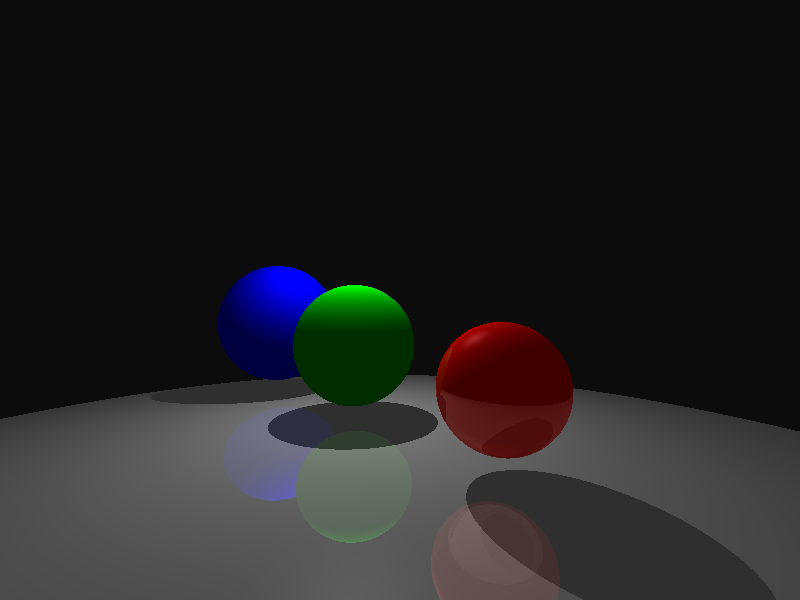
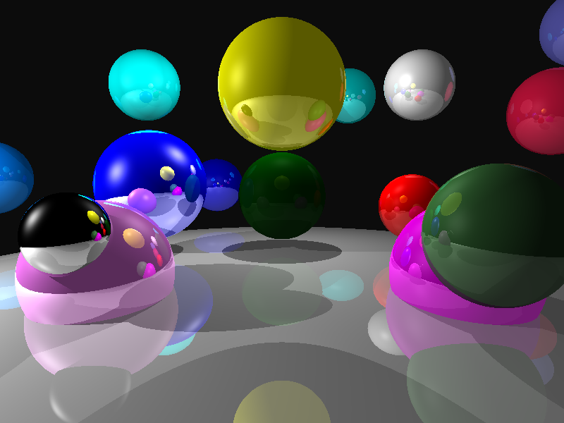
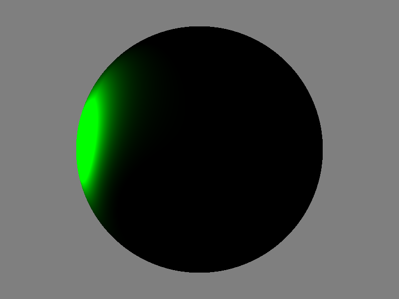

## Compile: 
g++ -fsanitize=address -std=c++11 rayTrace_vec3.cpp -o raytracer 

## Run: 
./raytracer [textfile.txt]

## Spheres 1
Render time: ~ 733.97 ms

  

## Spheres 2
Render time: ~ 4014.79 ms

  

## Spot Light Scene
Render time: ~ 326.27 ms

  

## Bear 
Render time: ~ 4233.24 ms

  

