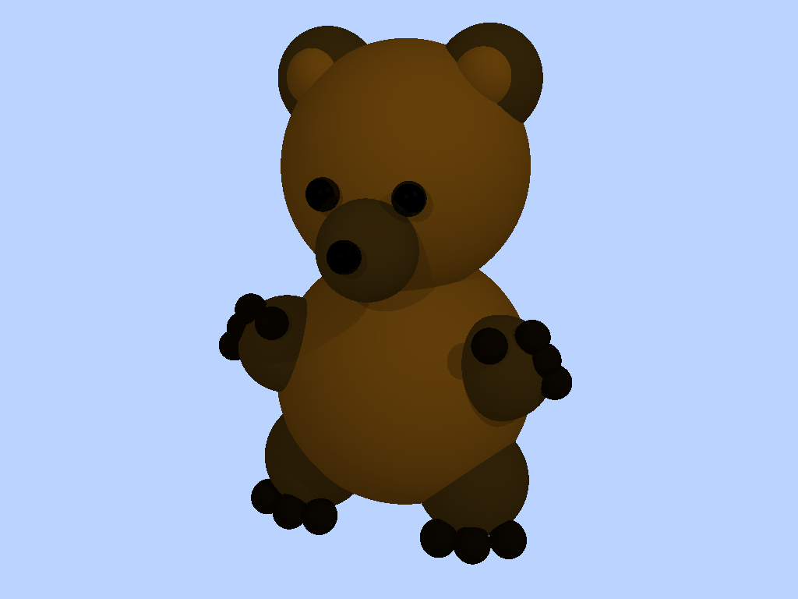

## Compile: 
g++ -fsanitize=address -std=c++11 rayTrace_vec3.cpp -o raytracer 

## Run: 
./raytracer [textfile.txt]

## Spheres 1
Render time: ~ 733.97 ms

  

## Spheres 2
Render time: ~ 4014.79 ms

  

## Spot Light Scene
Render time: ~ 326.27 ms

  

## Bear 
Render time: ~ 4233.24 ms

  

## Scene File Format

# Camera Setup
camera_pos: <x> <y> <z>
camera_fwd: <x> <y> <z>
camera_up: <x> <y> <z>
camera_fov_ha: <half_angle>

# Image Parameters
film_resolution: <width> <height>
output_image: <filename.png>

# Materials
material: <dr> <dg> <db> <sr> <sg> <sb> <ar> <ag> <ab> <shininess> <rr> <rg> <rb> <ior>
Where:
dr,dg,db = diffuse color (RGB)
sr,sg,sb = specular color (RGB)
ar,ag,ab = ambient color (RGB)
shininess = Phong exponent
rr,rg,rb = reflection color (RGB)
ior = index of refraction

# Objects
sphere: <cx> <cy> <cz> <radius>

# Lights
ambient_light: <r> <g> <b>
point_light: <r> <g> <b> <x> <y> <z>
directional_light: <r> <g> <b> <dx> <dy> <dz>
spot_light: <r> <g> <b> <px> <py> <pz> <dx> <dy> <dz> <angle1> <angle2>

# Scene Parameters
background: <r> <g> <b>
max_depth: <recursion_depth>

## Implementation Details
# Ray-Sphere Intersection
I used the quadratic formula to find where a ray hits a sphere. If there are multiple hits, I use the closest one in front of the camera.

# Phong Shading
I used the Phong lighting model, which combines ambient, diffuse, and specular light to make the objects look more realistic.

# Shadows
For each light, I send a shadow ray. If it hits something before the light, that point is in shadow.

# Reflection
Reflections are done by sending a new ray in the reflection direction:
R = I - 2(N · I)N

# Refraction
I used Snell’s law to bend light through transparent objects and mixed reflection and refraction using Fresnel equations.

# Limitations
At first, I started with the PGA code from Homework 3, but later I switched to vec3 since it was easier to use. I didn’t spend time optimizing the code because rendering wasn’t too slow and even the bear scene finished in just a few seconds. 
